# Music Visualizer — Infrastructure

A browser-based realtime AI visualizer. Audio in → ~15 features at 60 Hz → server orchestrates
prompts + generation triggers → fal.ai FLUX.2 returns keyframes → a WebGL2 displacement shader
carries continuity between them at 60 fps.

This document is the **single map of moving parts**: every runtime, network hop, datastore,
and external API the app touches in production.

> **Topology (post-cutover, live).** A **Caddy gateway** (`apps/gateway`) is the single
> public service. It path-routes `/api/auth/*`, `/rpc/*`, `/api/upload/*`, `/ws` to the
> **server** and everything else to the **web** app, over `*.railway.internal` — so the
> browser sees one origin (`sonara.fm`), cookies are first-party, and there's no CORS. The
> **server** owns Better Auth, the oRPC HTTP router, image upload, the Dodo webhook, and the
> WebSocket session; **web** is a thin frontend (no DB, no secrets). Canonical:
> `AGENTS.md §Production`, `DEPLOY.md`.

---

## 1. The 10-second picture

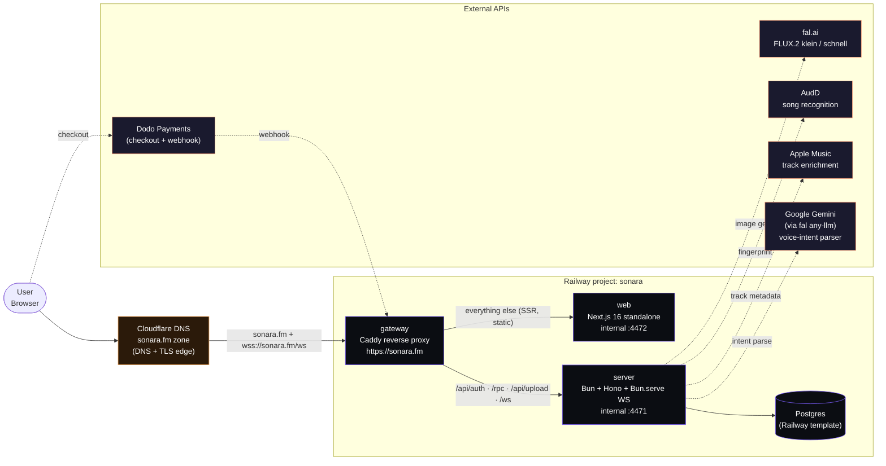

> **Note.** Everything ships from one git repo (Turborepo monorepo). Two Docker images.
> Three Railway services. Six external APIs. No queue, no Redis, no CDN of our own —
> frames are served as direct fal.ai URLs into `` tags via a WebGL texture upload.

---

## 2. Monorepo layout

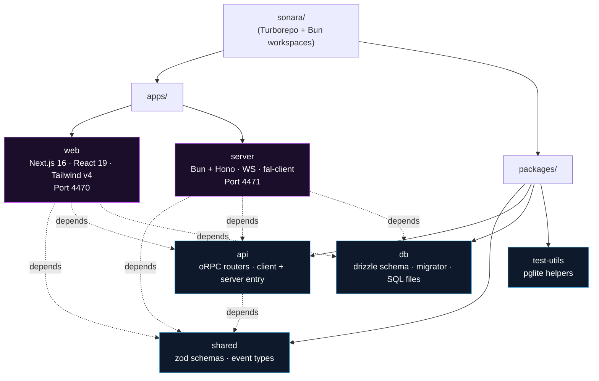

| Workspace | Role | Key deps |
|---|---|---|
| `apps/web` | Next.js standalone build, browser bundle, SSR pages | next 16, react 19, zustand, meyda, partysocket, better-auth, dodopayments |
| `apps/server` | Bun process: Hono HTTP + Bun.serve WebSocket | hono, @orpc/server, @fal-ai/client, pino, pg |
| `packages/shared` | Zod schemas + TS types for every event / state object | zod |
| `packages/api` | oRPC routers (HTTP `/rpc` + WS `/ws` session surface) | @orpc/server, @orpc/client |
| `packages/db` | Drizzle schema (`auth.db.ts`, `credits.db.ts`) + `runMigrations()` boot helper | drizzle-orm, node-postgres |
| `packages/test-utils` | pglite test database helper | drizzle-orm |

---

## 3. Runtime topology

### 3a. Inside the browser

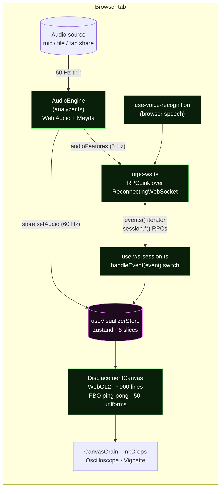

### 3b. Inside the server

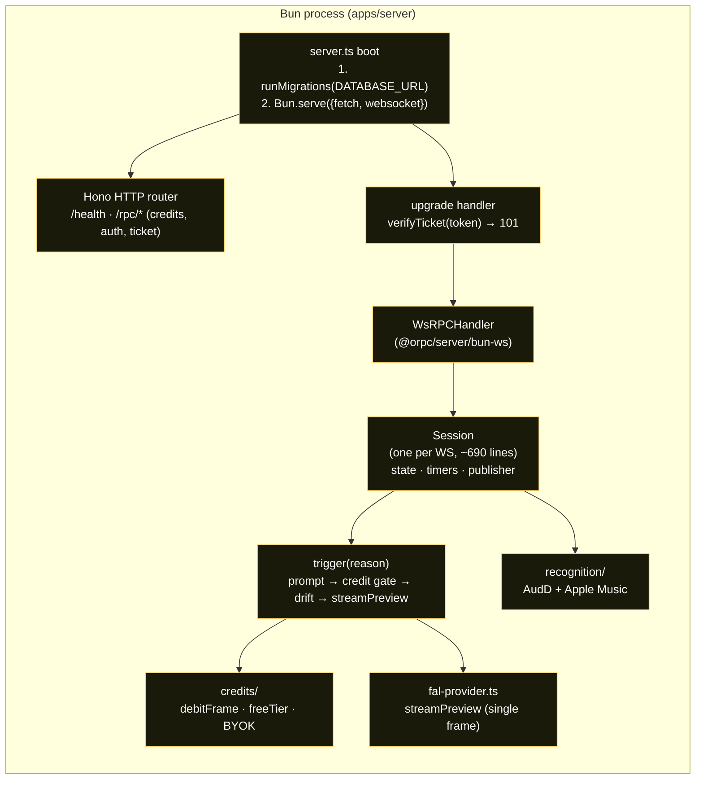

### 3c. Service responsibility table

| Service | Image source | Port | Healthcheck | Stateful? |
|---|---|---|---|---|
| `web` | `apps/web/Dockerfile` (Next.js standalone) | 3000 (Railway maps :443) | HTTP `/` | No |
| `server` | `apps/server/Dockerfile` | `$PORT` (Railway-injected, dev = 4471) | HTTP `/health` → `{"ok":true}` | In-memory only (Session per WS) |
| `Postgres` | Railway template | 5432 (internal) | Railway-managed | **Yes** (auth + credits ledger) |

---

## 4. Data flow — the four hot paths

### 4a. Audio tick (the firehose)

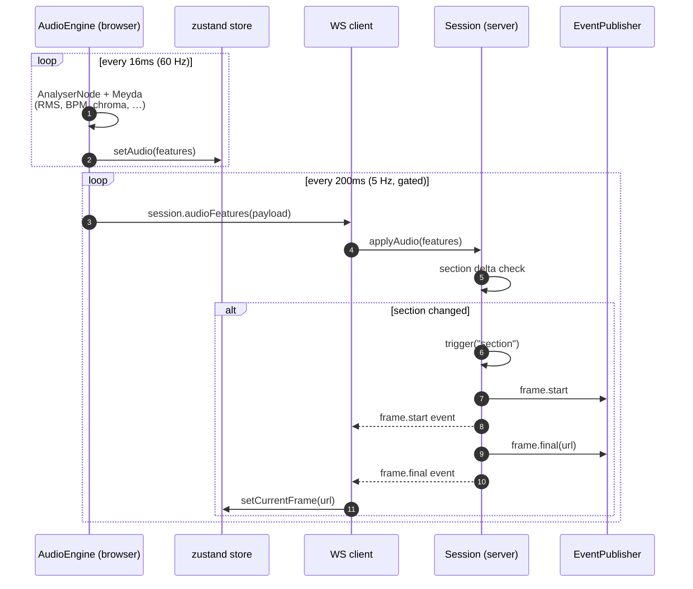

### 4b. Voice intent

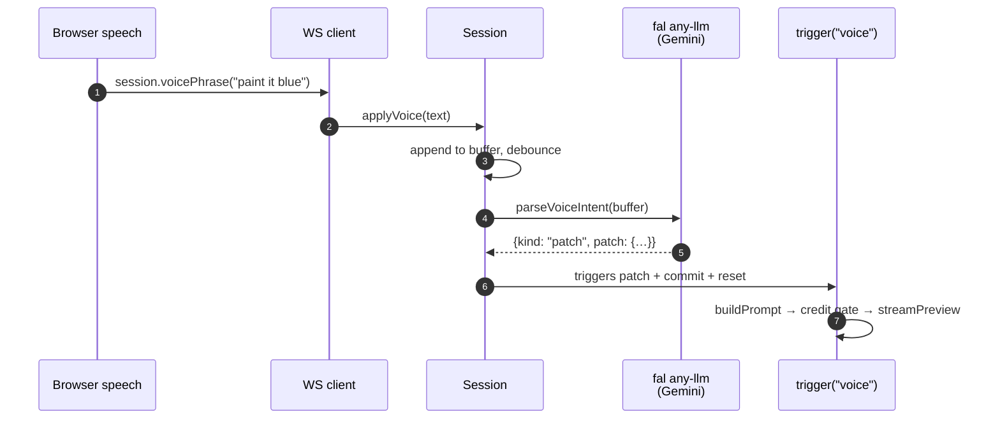

### 4c. Scene commit (manual)

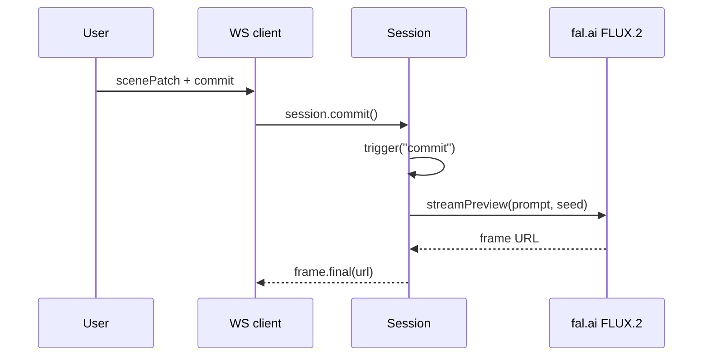

### 4d. Song recognition (background)

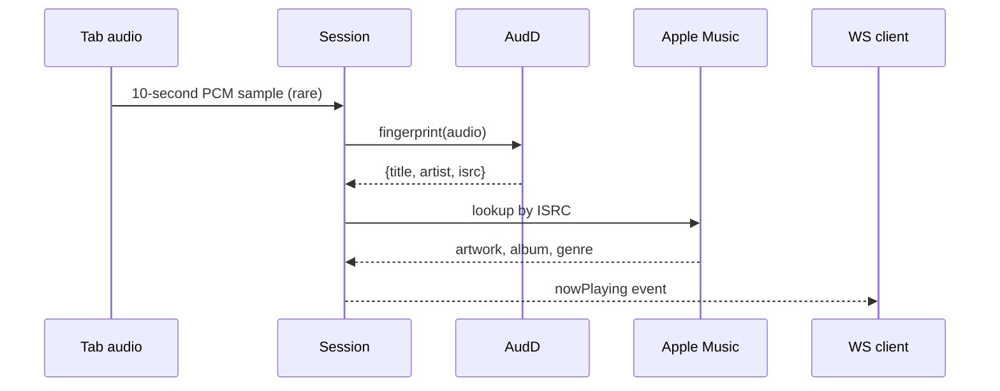

---

## 5. Transport — every wire on the network

All public traffic enters via the gateway on `https://sonara.fm`. The gateway path-routes to web or server internally.

| Channel | Protocol | URL | Auth | Direction |
|---|---|---|---|---|
| Web SSR + static | HTTPS | `https://sonara.fm/` (gateway → web) | none (public) | Browser ⇄ gateway ⇄ web |
| Better Auth | HTTPS | `https://sonara.fm/api/auth/*` (gateway → server) | better-auth cookie | Browser ⇄ gateway ⇄ server |
| oRPC (credits, ticket mint) | HTTPS | `https://sonara.fm/rpc/*` (gateway → server) | better-auth cookie | Browser ⇄ gateway ⇄ server |
| Image-anchor upload | HTTPS | `https://sonara.fm/api/upload/image` (gateway → server) | better-auth cookie | Browser ⇄ gateway ⇄ server |
| Dodo webhook | HTTPS | `https://sonara.fm/api/auth/dodopayments/webhook` (gateway → server, Better Auth plugin) | Dodo signature | Dodo → gateway → server |
| Healthcheck | HTTPS | `https://api.sonara.fm/health` (legacy fallback; gateway healthcheck via `/` on web is also fine) | none | Railway / curl |
| **Realtime session** | **WSS** | `wss://sonara.fm/ws` (gateway → server) | **HMAC ticket** (single-use, minted via RPC) | Browser ⇄ gateway ⇄ server |
| DB | TCP/TLS | `${{Postgres.DATABASE_URL}}` | password | server ⇄ Postgres |
| fal.ai | HTTPS | `https://fal.run/...` | `FAL_KEY` | server → fal |
| AudD | HTTPS | `https://api.audd.io/` | `AUDD_API_KEY` | server → AudD |
| Apple Music | HTTPS | (public) | none | server → Apple |
| Dodo Payments | HTTPS | `https://checkout.dodopayments.com/*` | API key + customer id | server → Dodo (checkout create) |

> **Note.** The ticket scheme survives the same-origin move because it cleanly carries
> identity to the WS upgrade without re-parsing cookies at the socket layer. The browser
> RPC-calls `auth.mintWsTicket()` on every reconnect, then includes the ticket as a query
> param; the server verifies on upgrade and rejects with 401 otherwise.

---

## 6. Deployment pipeline

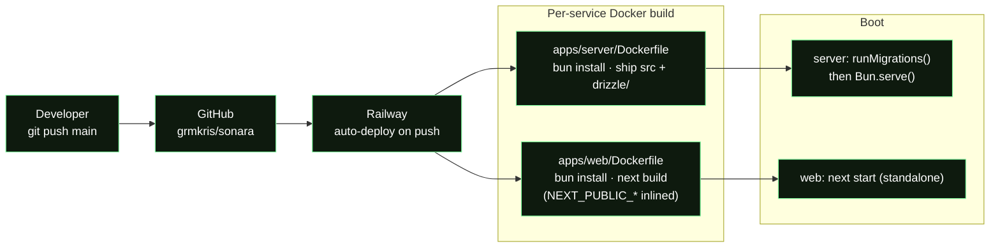

### Build-time vs runtime env

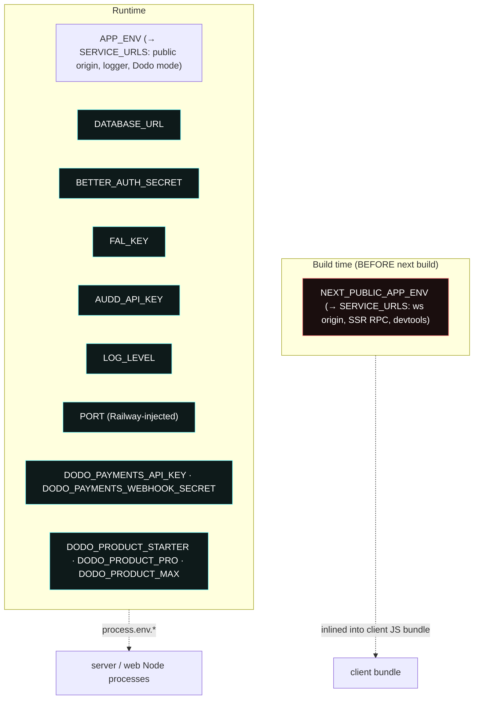

> **Important.** `NEXT_PUBLIC_*` must be set BEFORE the build runs. Next.js
> string-replaces these at compile time. Changing them on Railway after deploy does
> nothing until a fresh build is triggered.

---

## 7. Database

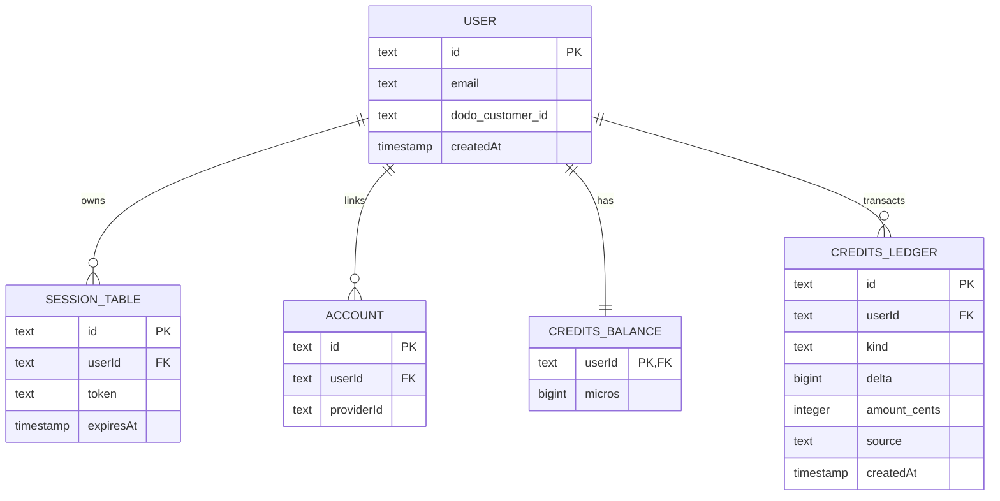

Top-ups land as `kind = 'topup'` rows in `CREDITS_LEDGER` (with `amount_cents` set and `source = 'dodo'`). There is no separate `TOPUP` table — the Dodo webhook writes a ledger row directly.

- **Schema source:** `packages/db/src/schema/` (`auth.db.ts`, `credits.db.ts`).
- **Migrations:** `packages/db/drizzle/*.sql`, applied by `runMigrations()` on every server boot. **No manual `db:push` in prod.**
- **Author:** drizzle-kit generates SQL from schema diff (`bun run --filter=@sonara/db db:generate`).

---

## 8. External integrations cheat-sheet

| Vendor | Purpose | Auth | Cost shape | Failure mode |
|---|---|---|---|---|
| **fal.ai** | FLUX.2 klein / schnell image gen | `FAL_KEY` (server-held); BYOK fallback per user | ~$0.003 / image · ~20 gens/min/user at intensity 1.0 → **~$0.36 / active-user-minute** | Server emits `frame.error`; client keeps last frame |
| **AudD** | Song fingerprint | `AUDD_API_KEY` | Per-call quota | Silent: `nowPlaying` stays null |
| **Apple Music** | ISRC → artwork / album / genre | none (public iTunes Search) | Free | Silent: partial metadata |
| **Google Gemini** | Voice-intent parser | routed via fal any-llm | Per-token via fal | Voice phrase ignored; user can re-speak |
| **Dodo Payments** | Credit-pack checkout + webhook | `DODO_PAYMENTS_API_KEY` + `DODO_PAYMENTS_WEBHOOK_SECRET` | Per-transaction fee | Checkout link unavailable; rest of app works (anon demo + already-balance users keep generating) |

---

## 9. Security surface

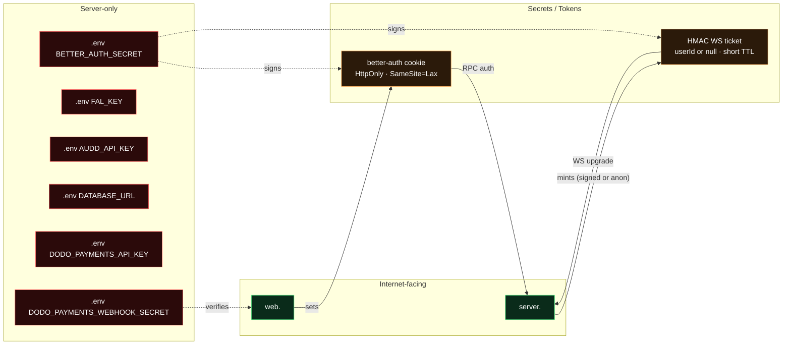

| Asset | Where it lives | Rotation |
|---|---|---|
| `BETTER_AUTH_SECRET` | Railway env (both services, identical) | `openssl rand -base64 32` → re-deploy both |
| `FAL_KEY` | Railway env, **server only** | Rotate in fal.ai dashboard, update env |
| `AUDD_API_KEY` | Railway env, **server only** | Rotate in audd.io, update env |
| `DODO_PAYMENTS_API_KEY` / `DODO_PAYMENTS_WEBHOOK_SECRET` | Railway env, **web only** | Rotate in Dodo dashboard, update env |
| WS ticket | Memory only, server signs/verifies, never persisted | TTL ~5min, anon or user-bound |

---

## 10. Observability & failure modes

| Signal | Source | What it means |
|---|---|---|
| `server` Railway logs | pino structured logs | Every trigger / fal call / credit debit |
| `server.ts` boot lines | `running database migrations` → `migrations applied` → `server listening` | Migration health on each deploy |
| `/health` | Hono route | Liveness for Railway healthcheck |
| `triggerLog` (client store) | events from server | Visible debug trail in dev UI |
| `frame.error` events | fal-provider rejection | Last frame held; user sees no flicker |

### Known degraded paths

1. **fal.ai rate limit / 5xx** → `frame.error` emitted; canvas holds last texture; client keeps shading (audio-reactive but static keyframe).
2. **AudD fail** → `nowPlaying` stays `null`; no UI badge; no behavior change.
3. **WS disconnect** → `partysocket` reconnects with exponential backoff; client re-mints ticket; on re-subscribe, `session.state()` bootstrap pull re-syncs.
4. **DB unreachable on boot** → `runMigrations` throws → process exits → Railway restarts service.
5. **WebGL2 unavailable** → `dream-canvas.tsx` shows "WebGL2 required" overlay (no CSS fallback exists since April 2026).

---

## 11. Cost envelope (back-of-envelope)

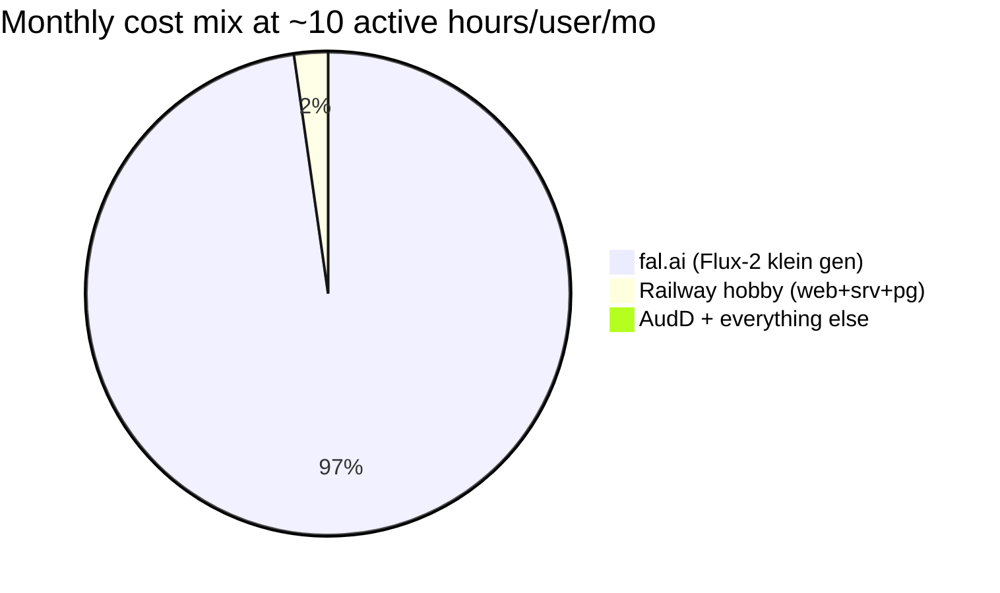

> Assumes intensity 1.0 (~20 gens/min) → 12 000 gens/user/mo · $0.003 = $36/user · times some users.
> **fal.ai dominates by two orders of magnitude.** Rate-limit + free-tier gates in
> `apps/server/src/credits/` exist primarily because of this.

---

## 12. What this doc does **not** cover

- **Client-side render pipeline internals** — see `ARCHITECTURE.md` §2b for the WebGL2 displacement shader, FBO ping-pong, Kuwahara pass, and 21 named presets.
- **Session state machine** — see `ARCHITECTURE.md` §2f for the trigger reasons and how `trigger()` funnels them into a single `streamPreview` call.
- **Refactor backlog** — see `ARCHITECTURE.md` §3 (smell list) and §4 (cleanup order).
- **Repo conventions for contributors** — see `AGENTS.md`.

---

> **Mental model in one line:** the browser does the rendering and audio analysis;
> the server is a thin *orchestrator* that turns scene + audio + voice into fal.ai
> prompts and emits events back; Postgres only stores auth + credits. Everything
> else is in-memory per WebSocket connection.
